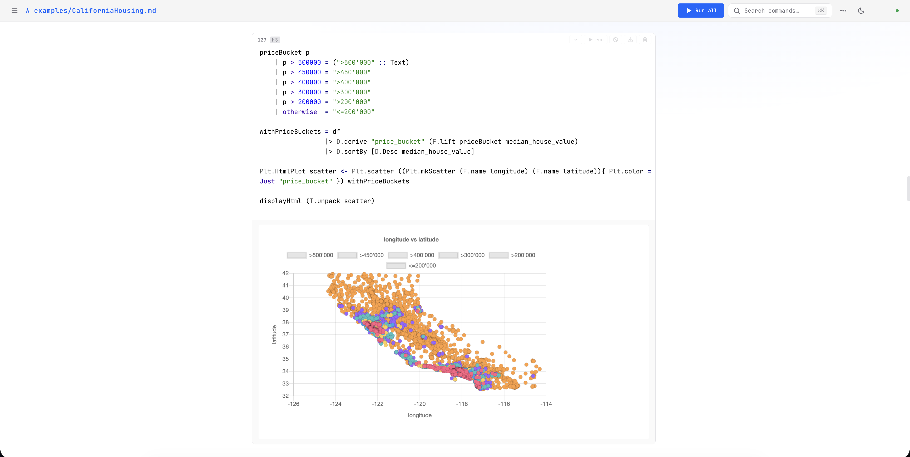

# sabela

Sabela is a reactive notebook for Haskell. The name is the
[Ndebele](https://en.wikipedia.org/wiki/Northern_Ndebele_language) word for
*to respond*, which is the behaviour it is built around.



## Quick start

```bash
git clone https://github.com/DataHaskell/sabela
cd sabela
cabal update
cabal run
```

Open `localhost:3000/index.html`, then either:

* open `examples/CaliforniaHousing.md` for a full worked example, taking
  California housing data through to a Hasktorch linear-regression model, or
* click the book icon, top left, for ready-to-run snippets.

The execution and dependency model is based on
[scripths](https://github.com/DataHaskell/scripths).

## What you can do

* **Run cells reactivly.** Sabela reruns the cells that
  depend on what you changed, and nothing else.
* **Add interactive controls/widgets.** A `slider`,
  `dropdown`, or `button` is one line of Haskell; drag it and the cell reruns
  with the new value.
* **Mix Haskell and Python in one notebook.** Load and type-check data in
  Haskell, hand it to pandas or matplotlib, pass the results back.
* **Pair with Claude Code.** Point the `siza` skill at your running notebook and
  Claude can read, run, and edit cells while you watch them change in the browser.
* **Present it.** Turn a notebook into a live dashboard or slideshow, or export
  it to standalone HTML, Markdown, or a runnable `.hs`.

# Tutorial

---

## 1. Install and run

```bash
git clone https://github.com/DataHaskell/sabela
cd sabela
cabal update
cabal run
```

Then open `http://localhost:3000/index.html`. By default the file explorer is
rooted at the current directory.

To pass options, the argument order is:

```text
sabela [port] [work-dir] [global-file] [packages...]
```

So to run on a different port with a notebook directory of your own:

```bash
cabal run sabela -- 8080 ~/notebooks
```

`global-file` defaults to `~/.sabela/global.md` (see [section 6](#6-adding-package-dependencies-inside-a-cell)); any
trailing arguments are extra packages to preinstall.

---

## 2. The notebook model

A notebook is an ordinary Markdown file: prose plus fenced Haskell blocks.

````markdown
# My first notebook

This is prose.

```haskell
x = 10
```

More prose.

```haskell
print (x + 5)
```
````

Fenced code blocks load as code cells, and the text between them loads as prose
cells. Saving writes the notebook back out as Markdown, so it diffs cleanly in
Git and edits fine outside the browser.

---

## 3. Your first reactive notebook

Make a file `examples/tutorial.md`:

````markdown
# Sabela basics

```haskell
x = 10
```

```haskell
y = 20
```

```haskell
print (x + y)
```
````

---

## 4. How reactivity works

When you edit a cell, Sabela parses every cell with `ghc-lib-parser`, a
standalone copy of GHC's own parser that works regardless of your GHC version.
From the syntax tree it reads the top-level names each cell defines and the
names each cell uses without binding them itself. That gives a real dependency
graph rather than a guess based on matching text.

Editing a cell reruns its dependents in dependency order, computed by a
topological sort rather than notebook position, so every value is recomputed
before the cells that read it. Two situations are reported instead of run:

* **Redefinitions.** The first cell to define a name owns it. A later cell that
  defines the same name is flagged with an error pointing back to the original,
  instead of silently shadowing it.
* **Cycles.** If two cells come to depend on each other, both are reported as a
  cycle rather than looping.

The analysis is scope-conservative: a name bound locally inside a `where`, a
`let`, a lambda, or a comprehension counts as bound, so it never invents a
dependency on another cell. It reasons about names rather than types, so it
won't chase a link that exists only through a typeclass instance, but for
everyday notebook code it tracks the dependencies accurately.

Cells still read best from top to bottom with one definition per name, though
you no longer have to keep the execution order right by hand.

---

## 5. Running plain Haskell

Anything that runs in GHCi runs in a cell:

```haskell
let triples =
      [ (a, b, c)
      | c <- [1..20]
      , b <- [1..c]
      , a <- [1..b]
      , a*a + b*b == c*c
      ]

print triples
```

The book icon in the top left opens a gallery of ready-to-run snippets: basics,
library usage, rich display, concurrency, QuickCheck, and file I/O.

---

## 6. Adding package dependencies inside a cell

A notebook carries its own package requirements. You declare them with
`-- cabal:` directives at the top of a cell:

```haskell
-- cabal: build-depends: text
import qualified Data.Text as T
import qualified Data.Text.IO as TIO

let msg = T.pack "Hello, Sabela!"
TIO.putStrLn (T.toUpper msg)
```

Extensions go the same way:

```haskell
-- cabal: build-depends: aeson, text, bytestring
-- cabal: default-extensions: DeriveGeneric, OverloadedStrings
```

The directives are per cell, but they apply to the whole notebook: Sabela merges
the `-- cabal:` lines from every cell into one package set. When that set
changes it resolves the package environment, restarts GHCi, reinjects the
display helpers, and reruns the cells that need it. Putting your main directives
near the top keeps the environment easy to read.

For dependencies you want in every notebook, put the same directives in a
`global.md` (by default `~/.sabela/global.md`).

---

## 7. Rich output helpers

Sabela injects display helpers into the session so a cell can emit structured
output instead of plain text:

| Helper | Output |
|--------|--------|
| `displayHtml` | HTML |
| `displayMarkdown` | Markdown |
| `displaySvg` | SVG |
| `displayLatex` | LaTeX |
| `displayJson` | JSON |
| `displayImage` | base64 image (takes a MIME type and the data) |

A plain `print` shows up as text. Rich output has to be the only thing the cell
prints.

### Markdown

```haskell
displayMarkdown $ unlines
  [ "# Analysis Results"
  , ""
  , "The computation found **42** as the answer."
  , ""
  , "| Metric | Value |"
  , "|--------|-------|"
  , "| Speed  | Fast  |"
  , "| Memory | Low   |"
  ]
```

### HTML

```haskell
displayHtml $ unlines
  [ "<h2>Hello from Sabela</h2>"
  , "<p>This is <strong>rich HTML</strong> output.</p>"
  , "<ul><li>Item one</li><li>Item two</li></ul>"
  ]
```

Files from the notebook work-dir are served via `/api/asset?path=<path>`, and can be used in the HTML.

### SVG

```haskell
-- cabal: build-depends: text, granite
{-# LANGUAGE OverloadedStrings #-}

import qualified Data.Text as T
import Granite.Svg

displaySvg $ T.unpack
  (bars [("Q1",12),("Q2",18),("Q3",9),("Q4",15)] defPlot { plotTitle = "Sales" })
```

Each helper prefixes its output with a MIME marker that the server strips before
sending the result to the browser.

---

## 8. Interactive widgets

A widget is an HTML control (slider, dropdown, checkbox, text box, button) that
lives in a cell's output and reruns the cell when you touch it. You write no
JavaScript: Sabela renders the control and carries its value back to GHCi to
rerun the cell.

Every widget is a `Behavior a`: a value that knows how to render itself and
sample its current value. The verb `display` does both: it draws the control
and returns the value:

```haskell
c <- display (slider "celsius" (20 :: Int) (-40) 120)
let f = c * 9 `div` 5 + 32

displayHtml $ "<p><b>" ++ show c ++ " °C</b> = " ++ show f ++ " °F</p>"
```

Drag the slider and the cell reruns with the new `c`. Any cell downstream that
uses `c` reruns too, because a widget value is an ordinary Haskell binding.

The full set:

| Widget | Returns |
|--------|---------|
| `slider name def lo hi` | the number, as you drag (debounced) |
| `dropdown name options def` | the chosen `String` |
| `checkbox name def` | a `Bool` |
| `textInput name def` | the current `String` |
| `button label name` | `Maybe ()` (`Just ()` once clicked) |
| `scatterSelect name points` | `[Int]`, the indices of the lassoed points |

`Behavior` is `Applicative`, so you can combine widgets into one value:

```haskell
area <- display (liftA2 (*) (slider "w" (10 :: Int) 1 100)
                            (slider "h" (10 :: Int) 1 100))
displayHtml $ "<p>Area: <b>" ++ show area ++ "</b></p>"
```

### Lasso a scatter plot

`scatterSelect` draws an HTML5 canvas and returns the indices of the points you
circle. Hand those to a row filter and a downstream cell shows exactly the rows
you selected:

```haskell
sel <- display (scatterSelect "districts" [(lon, lat) | (lon, lat) <- coords])

sel
```

---

## 9. Python in the same notebook

Pick **py** from the language dropdown in a cell's gutter and that cell runs in a
persistent Python REPL instead of GHCi. Variables persist down the notebook, and
the same `displayHtml` / `displayMarkdown` helpers work. (You need `python3` on
your `PATH`.)

```python
def fib(n):
    a, b = 0, 1
    for _ in range(n):
        a, b = b, a + b
    return a

print([fib(i) for i in range(10)])
```

The two languages run in separate processes, so they pass values through a
bridge rather than shared memory. Export from Haskell:

```haskell
exportBridge "names" (show names)
```

and the value arrives in Python as the string `_bridge_names`:

```python
import ast
names = ast.literal_eval(_bridge_names)
```

It works the other way too: `exportBridge("result", json.dumps(r))` in Python
surfaces as `_bridge_result` in Haskell, and exporting from Python reruns the
Haskell cells that read it. The usual move is to load and type-check data with
`DataFrame` in Haskell, ship it across as CSV, and let pandas or matplotlib take
over. `examples/tutorial-python-integration.md` and `examples/matplotlib-demo.md`
walk through it.

---

## 10. Pair-programming with Claude Code (siza)

Sabela exposes its notebook over a small REST API at `/api/ai/*`, and **siza** is
a Claude Code skill that drives it. With your notebook open in the browser and
siza installed in a second terminal, Claude can list cells, read them, run them,
propose edits you approve in the UI, and try code in a throwaway scratchpad.
Every change shows up live in your browser, against the same GHCi session you're
already using.

Install it from inside Claude Code:

```text
/plugin marketplace add /path/to/sabela/cli-skill
/plugin install siza
/reload-plugins
```

Then start Sabela (`cabal run`), open a notebook, and ask Claude things like
*"what's in my notebook?"*, *"run cell 3 and tell me what it prints"*, or
*"add a cell that plots median income against house value."* siza finds the
running server on its own: Sabela writes `~/.local/state/sabela/servers/<port>.json`
on startup, and the skill reads it.

On a shared or remote machine, gate the bridge with a token:

```bash
SABELA_AI_TOKEN=$(openssl rand -hex 16) cabal run
```

Clients then send `Authorization: Bearer <token>`; the rest of the UI stays
open. Full details are in `cli-skill/README.md`.

---

## 11. Presenting and exporting

A notebook isn't only for editing. Sabela serves the same notebook as a live
**dashboard** at `/dashboard` and a **slideshow** at `/slideshow`, and it can
export to a file you can hand off:

| `GET /api/export/…` | Output |
|------|--------|
| `markdown` | the notebook as plain `.md` |
| `dashboard` / `slideshow` | a standalone HTML page with the notebook baked in |
| `haskell` | a runnable `.hs` cabal script, sliced to a cell's dependencies |
| `lhs` | literate Haskell |
| `reactive` | a headless reactive-banana program |

Since the source of truth is Markdown, the simplest export of all is just saving
the file.

---

## 12. A minimal notebook

Drop this into `examples/minimal.md` for reactivity, Markdown output, and an
SVG plot in one file:

````markdown
# A tiny Sabela notebook

```haskell
numbers = [1..10]
```

```haskell
squares = map (^ (2 :: Int)) numbers
```

```haskell
print squares
```

```haskell
displayMarkdown $ unlines
  [ "# Summary"
  , ""
  , "Squares for " ++ show (head numbers) ++ " through " ++ show (last numbers) ++ "."
  , ""
  , "- Count: " ++ show (last numbers)
  , "- Max: " ++ show (last squares)
  ]
```
````

Edit `numbers` and the three cells below it update.

---

## 13. The California housing example

`examples/CaliforniaHousing.md` is a full end-to-end notebook on the California
housing dataset. It walks through:

* loading data with `DataFrame`
* inspecting rows and computing summaries
* categorical frequencies and histograms
* engineering derived features
* typed column references via Template Haskell
* scatter plots of the spatial structure
* correlations against the target variable
* training a Hasktorch linear-regression model
* evaluating predictions on held-out districts

If you'd rather start smaller, `examples/Iris.md` trains a decision tree on the
classic Iris set, and `examples/grammar-of-graphics.md` builds layered charts
with Granite's grammar-of-graphics API.

---

## 14. Looking up names from the session

The lookup panel queries the live session for completions, `:info`, `:type`,
and `:doc`. Once a notebook has loaded its modules and defined its names, you can
inspect them from the same session you're running cells in, which is useful when
you're learning an API as you go.

---

## 15. Files, loading, and saving

Sabela's file explorer is rooted at the working directory, so you can open
existing notebooks, create files and directories, and save back to disk from the
UI. Because notebooks are plain Markdown, a layout like:

```text
examples/
  basics.md
  plotting.md
  CaliforniaHousing.md
```

is just files on disk and works naturally with Git and code review.

---

## 16. Errors and debugging

When a cell fails, Sabela captures GHCi's stderr and parses it into structured
errors, with line and column information where GHCi provides it. Fixing a broken
upstream cell repairs its dependents on the next rerun.

A few things that help:

* keep imports and `-- cabal:` directives near the top
* give complicated definitions their own cell
* prefer named helpers over deeply nested one-liners
* use `print` for debugging and the `display*` helpers for presentation

---

## 17. How Sabela executes cells

Sabela keeps one long-lived GHCi process per notebook, started with
`-ignore-dot-ghci` plus the extensions and package environment from the
notebook's metadata. To run a cell it:

1. parses the source as a script fragment
2. renders it into GHCi script text
3. sends those lines to the session
4. writes a unique marker after them
5. drains stdout until the marker appears
6. collects stderr separately
7. parses out MIME markers and error locations
8. broadcasts the result to the frontend

The marker is the trick that lets one long-lived process serve a whole notebook
while keeping each cell's output separate. Python cells work the same way
against their own REPL.

---

## 18. Current limitations

Sabela is a young project with some rough edges. The constraints worth knowing
about:

* each language runs in a single session for the notebook
* changing the package environment restarts that session
* the Haskell↔Python bridge passes values as strings, not live objects

---

## 19. A good notebook style

Notebooks read best when you:

* **put setup first**: directives, extensions, imports, and small helpers up top
* **give each step its own cell**: loading, cleaning, feature engineering,
  plotting, modelling, interpretation
* **name intermediate values** instead of nesting everything in one expression
* **avoid binding expensive values at the top level**, to keep memory down
* **write the prose as a document**: explain what each step does and what its
  output means, so the notebook reads as well as it runs
